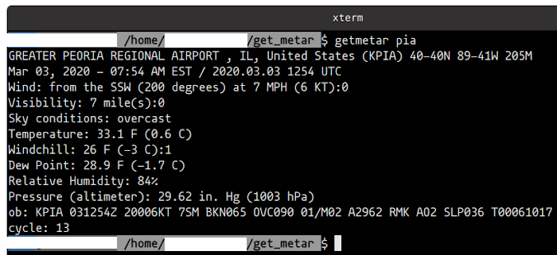

# get_metar_nick3499
Get decoded METAR data: Python3: subprocess.run(), click



## Tested Using:

- Ubuntu 20.04 Focal Fossa (development branch)
- Linux nick-CM1630 5.4.0-14-generic
- Python 3.8.2
- GNOME Shell 3.35.91

## Help

To print the help display, enter the following in the terminal emulator:

```shell
$ python3 get_metar.py --help
```

## Launch the App

The following command line arguments could be appended to a shell script named `.getmetar`. `$1` functions similar to Python's [sys.argv[1]](https://docs.python.org/3/library/sys.html#sys.argv) where, for example, if a user appended a function to `.bashrc` run commands, named `getmetar`, which included `$1` for the first command line argument passed to `getmetar` (see `getmetar mor` example below).

```shell
/bin/python3 $HOME/scripts/get_metar/get_metar.py --station $1
```

To get the decoded METAR data for the Morris Municipal Airport (KC09), enter the command line arguments below:

```shell
$ bash .getmetar mor
```

A function could also be added to the `.bashrc` run commands file:

```shell
function getmetar() {
  /bin/python3 $HOME/.userpy/get_metar/get_metar.py --station $1
}
```

Then execute the following command line arguments:

```shell
$ getmetar mor
```

## Shebang Line

```python
#! /bin/python3
```

>The shebang is actually a human-readable instance of a magic number in the executable file, the magic byte string being 0x23 0x21, the two-character encoding in ASCII of #!. This magic number is detected by the "exec" family of functions, which determine whether a file is a script or an executable binary. The presence of the shebang will result in the execution of the specified executable, usually an interpreter for the script's language.

[Shebang_(Unix): Magic number: Wikipedia](https://en.wikipedia.org/wiki/Shebang_(Unix)#Magic_number)

## Imports

```python
from subprocess import run
import click
```

`subprocess.run()` method is used for executing Bash command line arguments from a Python executable. For example, the following Python instruction gets the decoded METAR data for current conditions.

>If _check_ is true, and the process exits with a non-zero exit code, a CalledProcessError exception will be raised. Attributes of that exception hold the arguments, the exit code, and stdout and stderr if they were captured.

[subprocess — Subprocess management: Using the subprocess Module](https://docs.python.org/3/library/subprocess.html#using-the-subprocess-module)

```python
run(['curl', '-s', 'ftp://tgftp.nws.noaa.gov/data/observations/metar/decoded/KJOT.TXT'], check=True)
```

Which translates to the following in the CLI:

```shell
$ curl ftp://tgftp.nws.noaa.gov/data/observations/metar/decoded/KJOT.TXT
```

`click.group()` method is being used to group methods together. For example, the following command line arguments retrieve METAR data for Morris Municipal Airport.

```shell
$ python3 get_metar.py --station mor
```

The `--station` option was made available by the `click.option()` method, and `station` was passed as an argument to the `get_decoded_metar()` method:

```python
@click.group()
@click.option('--station/--no-station', default=False)
def get_decoded_metar(station):
```

The grouped commands are then bound to `get_decoded_metar()` using the `click.command()` method.

```python
@get_decoded_metar.command()
def dbq():
    _get_data('KDBQ.TXT')
```

The `get_data()` function is defined before the others because it can be used by all four methods that extract METAR data:

```python
def _get_data(icao_code):
    return run(['curl', '-s', 'ftp://tgftp.nws.noaa.gov/data/observations/metar/decoded/' + icao_code], check=True)
```

## Standalone

If `get_metar.py` is executed as an app, its `__name__` will be `__main__` and the `get_decoded_metar()` method will run. But if it is imported into another executable Python app, its name will no longer be `__main__`, and it will need to be called with dot syntax. For example: `get_metar.get_decoded_metar()`.

```python
if __name__ == '__main__':
    get_decoded_metar()  # if standalone, run app
```
